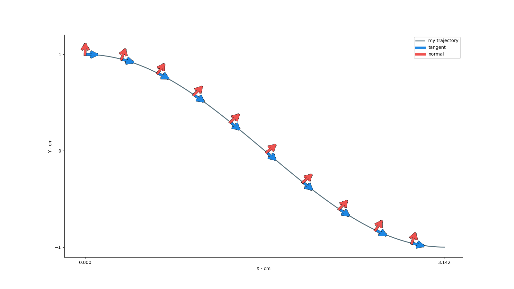

# Kino

`Kino` is a python package to compute and analyze locomotion kinematics from 2D animal tracking data. This is **currently still under development** and is thus not ready for use yet.


## Installation
```
    pip install kino
```

## Basic concepts
The `scripts` folder containtes `.py` files illustrating single concepts in `kino` while `docs` contains jupyter notebooks explaining these concepts more in details (work in progress)

### Animal

- docs not ready -

### Geometry
`Kino.geometry` contains code to intuitively represent and manipulate geometric entiteis such as trajectories and vectors. 

#### Trajectory
A `kino.geometry.Trajectory` object stores a set of `XY` coordinates denoting the position of e.g. a tracked body part over time. `Trajectory` can compute kinematics variables such as:

- velocity vector
- acceleration vector
- tangent direction vector
- normal direction vector
- curvature
- angle
- speed
- angular velocity
- angular acceleration

and can optionally perform smoothing over these variables.

Some of the kinematics variables are scalar, while others are (two dimensional) vector quantities. These are represented by the `kino.geometry.Vector` class.



#### Vector
The `kino.geometry.Vector` class represents a 2D vector (or a sequence of 2D vectors, e.g. the velocity vector over a sequence of frames). It implements methods that you would expect to perform operations on vectors (vectors addition and scalar multiplication) and other convenient methods (e.g. to get the vector magnitude or angle as well as the `dot` product between vectors).

### Locomotion
- docs not ready -


### Draw
Code to facilitate plotting of `kino` elements such as geometric object, `Animal` and `Locomotion`.

- docs not ready -


### Animate
Code to create smooth animations from kinematics data.

- docs not ready -


# Development
`Kino` is still very much under active development and it will be so for the next few months. For more information, or if you'd like to contribute, get in touch.
